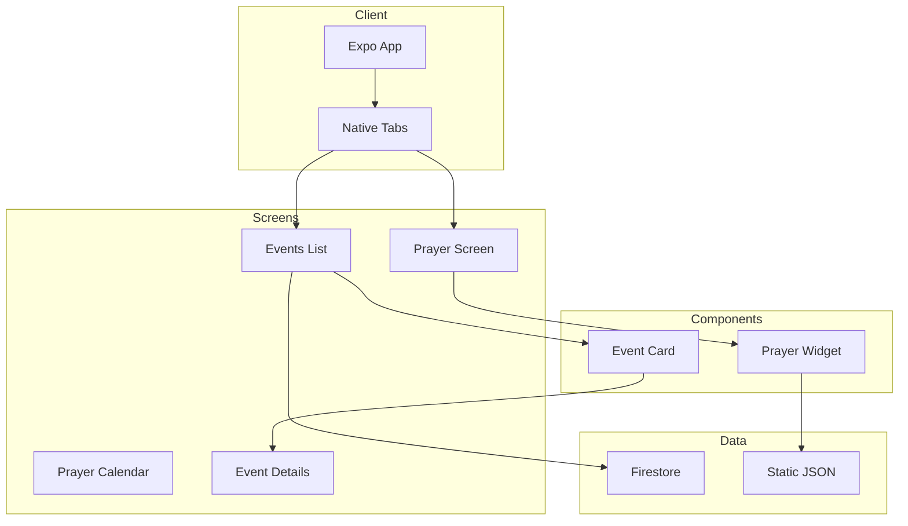

# Codebase Map — MWHS App (Expo RN)

> Auto-generated by Cartographer. Last mapped: March 12, 2026

## System Overview

A React Native + Expo prayer times and events app for Masjid al-Farooq. Features live prayer countdowns, monthly calendars with DST/Ramadan support, and real-time event listings via Firebase Firestore.



---

## Project Structure

```
.
├── app/                          # Expo Router screens
│   ├── _layout.tsx               # Root: fonts, error boundary, stack
│   ├── (tabs)/
│   │   ├── _layout.tsx           # Native tabs (Prayer | Events)
│   │   ├── index.tsx             # Prayer times screen
│   │   └── events.tsx            # Events list screen
│   ├── events/
│   │   └── [id].tsx              # Event detail (dynamic route)
│   ├── prayer-calendar.tsx       # Monthly calendar view
│   └── modal.tsx                 # Template (not wired)
│
├── components/
│   ├── ErrorBoundary.tsx         # React error boundary
│   ├── ui/
│   │   └── Button.tsx            # Button with variants
│   ├── events/
│   │   └── EventCard.tsx         # Event list item
│   └── prayer/
│       └── PrayerWidget.tsx      # Main prayer display
│
├── lib/
│   ├── firebase.ts               # Firebase singleton init
│   ├── events.ts                 # Firestore event queries
│   ├── hooks/
│   │   └── useEventsSubscription.ts  # Real-time events hook
│   ├── prayer-times.ts           # Prayer calculations & DST
│   └── time.ts                   # Sheffield timezone utils
│
├── store/
│   └── auth.ts                   # Zustand auth store
│
├── types/
│   ├── user.ts                   # User Zod schema
│   ├── event.ts                  # Event interface
│   ├── prayer.ts                 # Prayer types (15+ interfaces)
│   └── moment-hijri.d.ts         # Hijri ambient types
│
├── constants/
│   └── index.ts                  # Design tokens + config
│
├── assets/data/
│   ├── prayer/                   # Monthly prayer times (12 JSON)
│   ├── docs/
│   │   └── dst-start-end.json    # UK DST dates (2025-2100)
│   └── prayer/ramadan.json       # Ramadan times
│
├── __tests__/                    # Jest test suite
│   ├── components/
│   ├── lib/
│   ├── screens/
│   ├── store/
│   └── types/
│
├── docs/
│   └── CODEBASE_MAP.md
│
├── app.json                      # Expo config
├── package.json                  # Dependencies
├── tsconfig.json                 # TypeScript + path aliases
├── babel.config.js               # Module resolver
├── jest.config.js                # Jest setup
└── .env.example                  # Env template
```

---

## Architecture

### Routing (Expo Router)

| Route | Type | Description |
|-------|------|-------------|
| `(tabs)` | Group | Tab navigator |
| `(tabs)/index` | Tab | Prayer times (default) |
| `(tabs)/events` | Tab | Events list |
| `events/[id]` | Dynamic | Event details |
| `prayer-calendar` | Push | Monthly calendar |
| `modal` | Static | Template (unwired) |

**Navigation Stack** (`app/_layout.tsx`):
- Root `Stack` with three screen groups
- Native tabs via `expo-router/unstable-native-tabs`
- Headers styled with `deepNavy` (#0A1628)

### State Management

| Layer | Tool | Purpose |
|-------|------|---------|
| Global | Zustand (`store/auth.ts`) | Auth session, user |
| Server | Firebase Firestore | Events real-time data |
| Local | React Query (`@tanstack/react-query`) | API caching |
| UI | `useState` | Component state |

### Data Flow

```
User Action
    │
    ▼
Screen (app/)
    │  calls
    ▼
Hook (lib/hooks/) or Store (store/)
    │  fetches/mutates
    ▼
Firebase Firestore / Static JSON
    │  returns
    ▼
Type (types/) → UI Component
```

---

## Module Guide

### `lib/prayer-times.ts`

**Purpose**: Core prayer time calculations with DST, Ramadan, summer schedule logic

**Key exports**:
- `buildPrayerDayBundle(date)` — Returns full daily prayer data
- `buildPrayerCalendarForMonth(date)` — Monthly calendar data
- `getNextPrayerCountdown(bundle, now)` — Live countdown state
- `isSummerPeriod(date)` — May 15 - Aug 15 check

**Dependencies**: `moment-hijri`, `assets/data/prayer/*.json`, `assets/data/docs/dst-start-end.json`

**Gotchas**:
- Summer period forces Isha to "After Maghrib"
- Jummah replaces Dhuhr on Fridays
- DST adjustment adds/subtracts 1 hour in March/October

### `lib/events.ts`

**Purpose**: Firebase Firestore data layer for events

**Key exports**:
- `subscribeToEvents(callback)` — Real-time subscription
- `getAllEvents()` — Fetch all events
- `getEventById(id)` — Single event fetch
- `mapDocToEvent(doc)` — Firestore → Event mapper

**Dependencies**: Firebase SDK, `lib/firebase.ts`

### `lib/hooks/useEventsSubscription.ts`

**Purpose**: App-state-aware events subscription

**Pattern**: Dual lifecycle — subscribes only when:
1. `AppState === 'active'`
2. Screen is focused

**Returns**: `{ events, loading, error }`

### `store/auth.ts`

**Purpose**: Global auth state via Zustand

**State**: `{ user, isAuthenticated, isLoading }`

**Actions**: `login(user)`, `logout()`, `setLoading(bool)`

**Validation**: Uses `UserSchema.safeParse()` — silent fail on invalid

---

## Types

### `types/prayer.ts` (15+ interfaces)

| Type | Purpose |
|------|---------|
| `PrayerName` | `'fajr' \| 'sunrise' \| 'dhuhr' \| 'jummah' \| 'asr' \| 'maghrib' \| 'isha'` |
| `PrayerTime` | Raw API data (`date, fajr, shurooq...`) |
| `IqamahTimeRange` | Date-ranged iqamah times |
| `PrayerCountdown` | UI countdown state |
| `PrayerDayBundle` | Complete daily bundle (raw + adjusted) |
| `PrayerCalendarDay` | Calendar view cell data |

### `types/user.ts`

**Pattern**: Zod-first — schema defines type
```typescript
UserSchema = z.object({
  id: z.string().min(1),
  name: z.string().min(1),
  email: z.string().email(),
  avatar: z.string().url().optional()
})
type User = z.infer<typeof UserSchema>
```

### `types/event.ts`

Plain TypeScript interfaces (no runtime validation)

---

## Constants (`constants/index.ts`)

| Token | Values |
|-------|--------|
| `COLORS` | 17 colors (deepNavy, steelBlue, offWhite, primary...) |
| `GRADIENTS` | Prayer card gradient array |
| `SPACING` | 8-step scale (xxs:4 → xxxl:40) |
| `RADII` | sm:10, md:16, lg:24, pill:999 |
| `FONT_SIZES` | xs:12 → display:52 |
| `FONT_FAMILIES` | Aileron variants + Caslon3 |
| `APP_CONFIG` | siteUrl, timezone: 'Europe/London', mosqueName |

---

## Environment Variables

| Variable | Required | Description |
|----------|----------|-------------|
| `EXPO_PUBLIC_MWHS_SITE_URL` | Yes | Main website |
| `EXPO_PUBLIC_FIREBASE_*` | Yes | Firebase config (7 vars) |

---

## Testing

**Run**: `bun test`

**Pattern**: Jest + React Native Testing Library

| File | Coverage |
|------|----------|
| `Button.test.tsx` | Component |
| `PrayerWidget.test.tsx` | Jummah rendering |
| `auth.test.ts` | Zustand store |
| `user.test.ts` | Zod validation |
| `prayer-times.test.ts` | Countdown, DST, summer |
| `events.test.ts` | Firestore mapping |
| `EventsScreen.test.tsx` | Integration |
| `PrayerScreen.test.tsx` | Integration |

**Coverage targets**: `components/`, `lib/`, `store/`, `types/`

---

## Gotchas

1. **Silent auth failure** — Invalid user data fails silently (dev-only log)
2. **Naming inconsistency** — `shurooq` vs `sunrise` in prayer types
3. **Duplicate data** — `PrayerDayBundle` has both raw + adjusted times
4. **Unstable API** — `NativeTabs` from `expo-router/unstable-native-tabs`
5. **Hardcoded dates** — Tests use 2026 dates, may need updates
6. **Modal not wired** — `app/modal.tsx` exists but not registered in stack

---

## Adding Features

1. **New screen** → `app/screen-name.tsx`
2. **New component** → `components/ui/Component.tsx`
3. **New Firebase query** → `lib/feature.ts`
4. **New hook** → `lib/hooks/useFeature.ts`
5. **New type** → `types/feature.ts` (use Zod if validated)
6. **New test** → `__tests__/path/to/feature.test.tsx`
7. **New prayer data** → `assets/data/prayer/month.json`

---

## Stack

- **Framework**: Expo SDK 55 / React Native 0.83 / React 19.2
- **Routing**: Expo Router (file-based)
- **State**: Zustand + React Query
- **Backend**: Firebase Firestore
- **Validation**: Zod
- **Testing**: Jest + React Native Testing Library
- **Package Manager**: Bun
